<p align="center">
  
</p>

# ng-nx-scaffolder


IntelliJ / WebStorm plugin for scaffolding Angular and Nx libraries. Uses `nx generate` under the hood to create the library structure, then adds Angular architectural patterns on top.

## Requirements

- IntelliJ IDEA Ultimate 2024.1+ or WebStorm 2024.1+
- Java 17+
- **Angular 17+** — generated code uses standalone components, `inject()`, and `@ngrx/signals` signalStore
- **Nx 16+** workspace with `@nx/angular` installed
- Node.js with `npx` available in PATH

## How It Works

1. You select a lib type and fill in the dialog (name, prefix, options)
2. Plugin auto-detects workspace tools (ESLint, Jest/Vitest, Stylelint, Prettier)
3. **Dry-run preview** shows which files Nx will create — you confirm before proceeding
4. Plugin runs `nx generate @nx/angular:library` to create the lib scaffold (all config files)
5. Plugin replaces the default component with the architectural pattern you selected
6. Success notification with the lib name

All config files (tsconfig, jest/vitest, eslint, project.json, etc.) come directly from Nx — no hardcoded templates.

## Features

### Nx Library Generators

Access via **Right-click > New > ng-nx-scaffolder** or **File > New > ng-nx-scaffolder**.

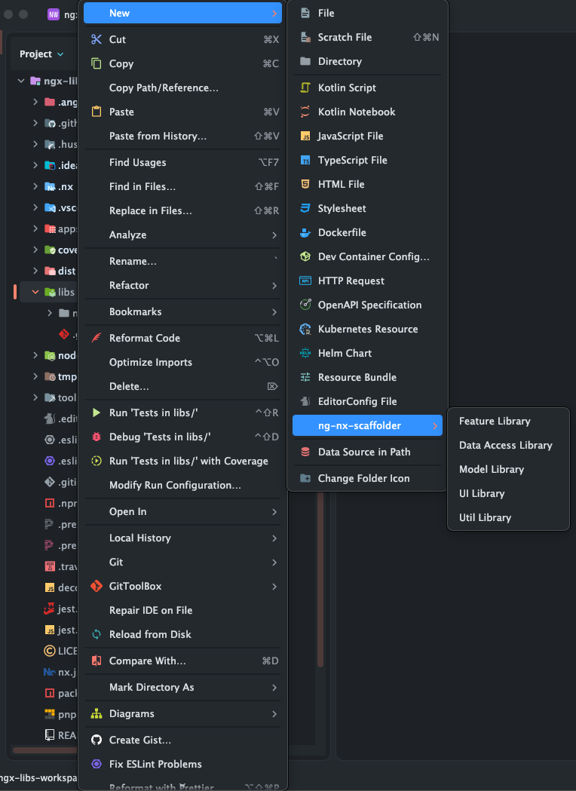

---

#### Feature Library

Generates a full feature lib with a container component and optional architectural layers:

| Option | Default | What it generates |
|-|-|-|
| Store | on | `store/{name}.store.ts`, `{name}.state.ts`, `{name}.store.spec.ts` — NgRx SignalStore |
| Facade | off | `facade/{name}-facade.service.ts` + spec — abstraction layer over store |
| Form | off | `form/{name}-form.service.ts`, `{name}-form.model.ts` + spec — typed reactive form |
| Routing | off | `{name}.routes.ts` — Angular route config |

Always generates: container component (`.ts`, `.html`, `.scss`, `.spec.ts`), mapper, models folder, barrel `index.ts`.

<details>
<summary>Screenshots</summary>

| Create | Preview | Generated |
|-|-|-|
| 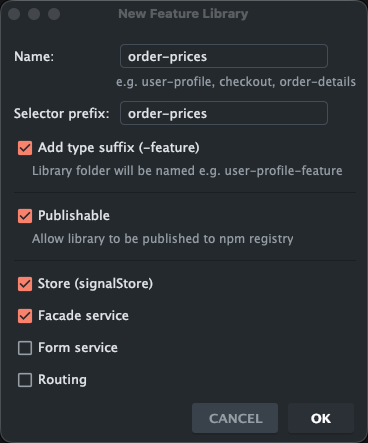 | 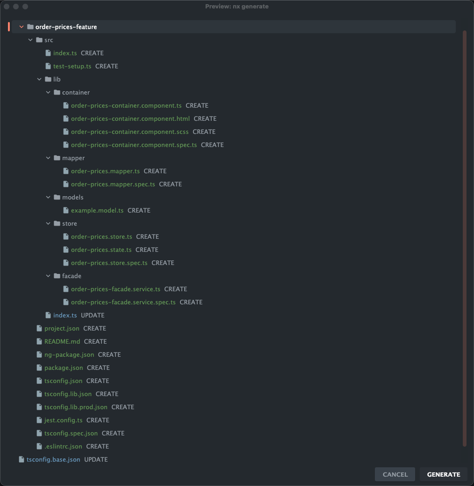 | 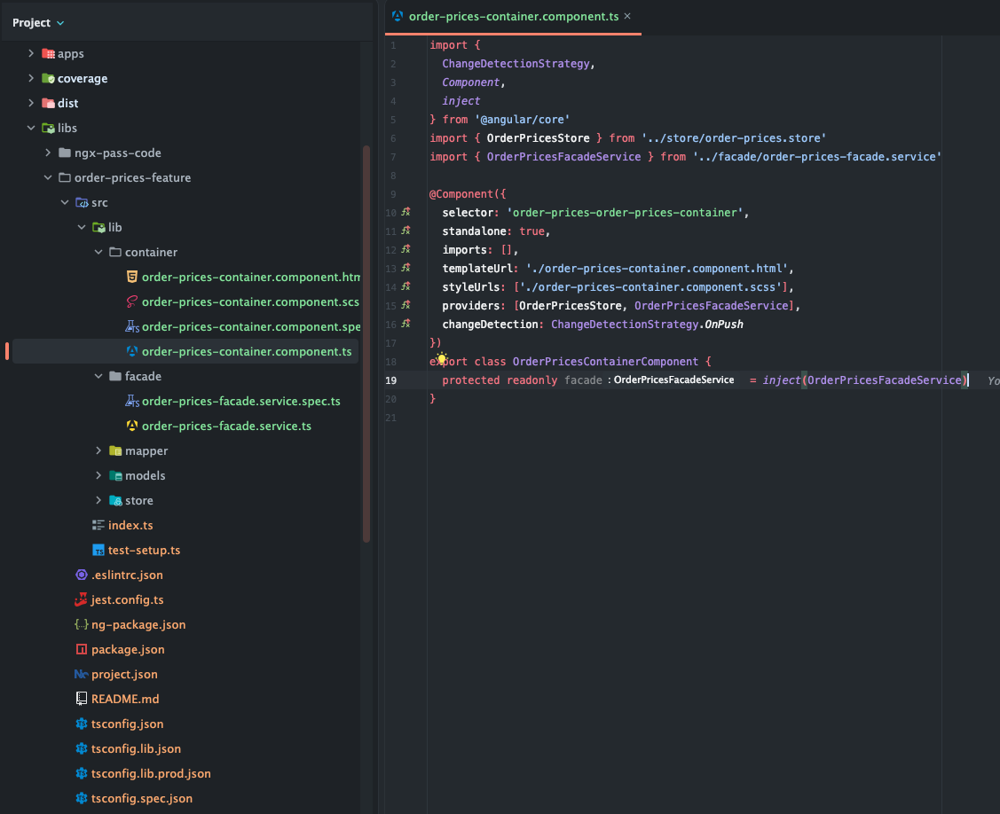 |

</details>

---

#### Data Access Library

Generates an Angular service with `HttpClient` injection + spec.

<details>
<summary>Screenshots</summary>

| Create | Preview | Generated |
|-|-|-|
| 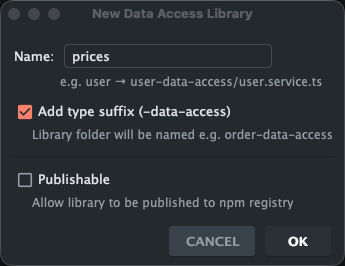 | 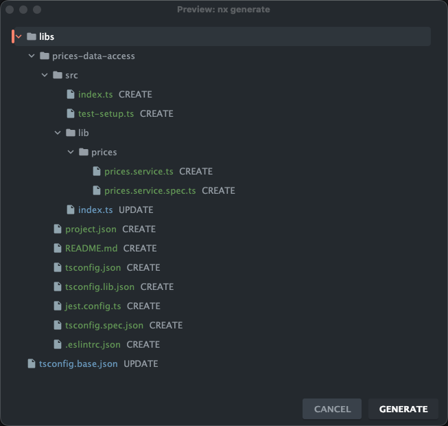 | 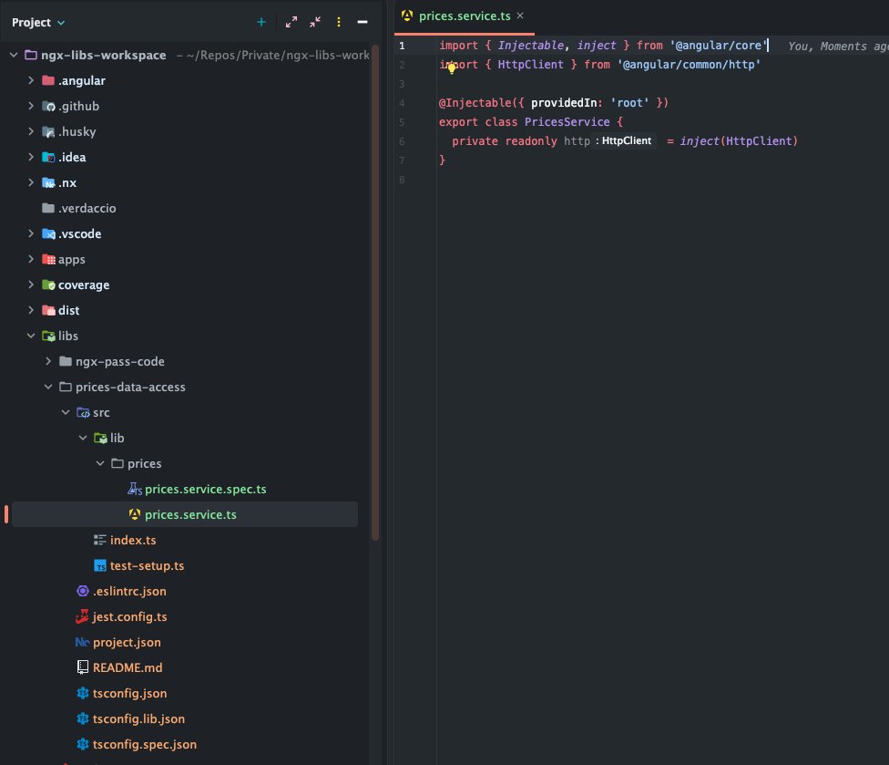 |

</details>

---

#### Model Library

Generates a TypeScript interface file with barrel export.

<details>
<summary>Screenshots</summary>

| Create | Preview | Generated |
|-|-|-|
| 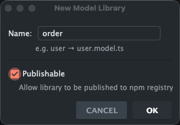 | 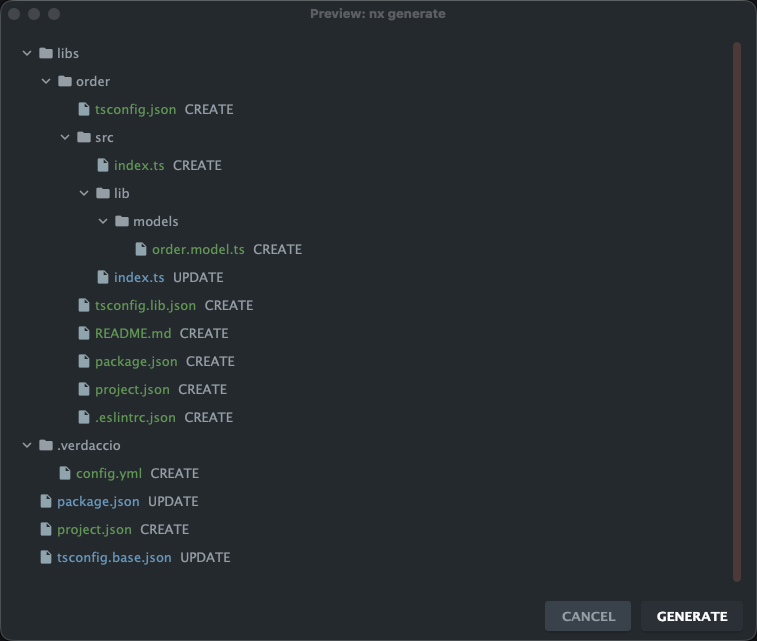 | 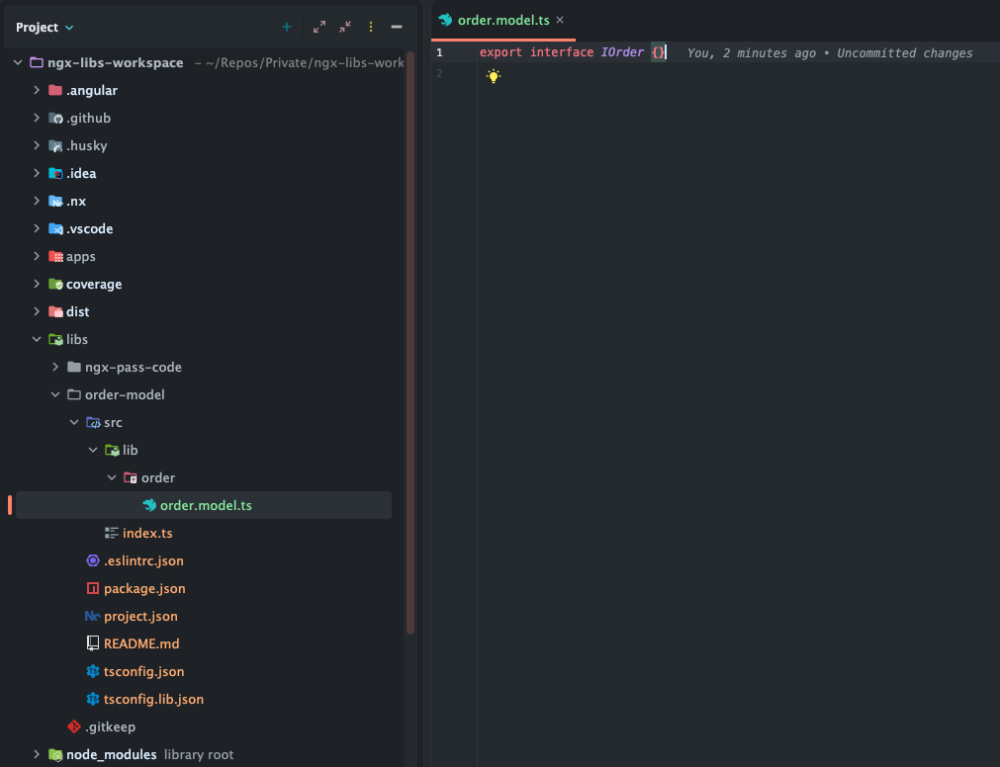 |

</details>

---

#### UI Library

Generates a standalone Angular component (OnPush, signals) with barrel export.

<details>
<summary>Screenshots</summary>

| Create | Preview | Generated |
|-|-|-|
| 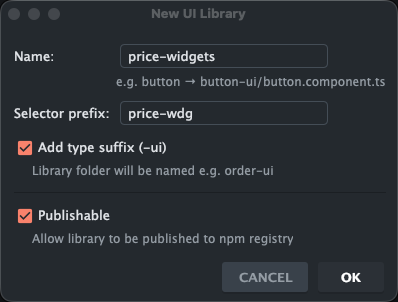 | 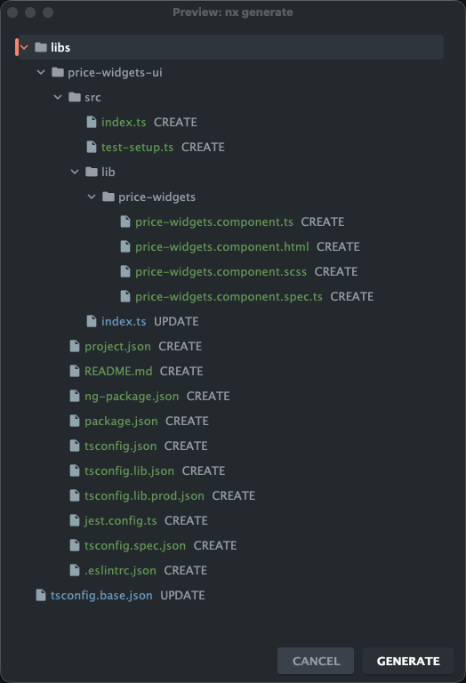 | 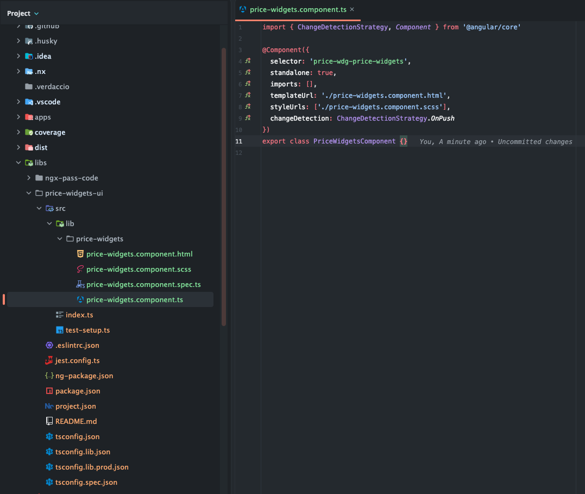 |

</details>

---

#### Util Library

Generates a utility file with spec and barrel export.

<details>
<summary>Screenshots</summary>

| Create | Preview | Generated |
|-|-|-|
| 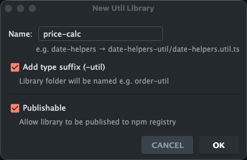 | 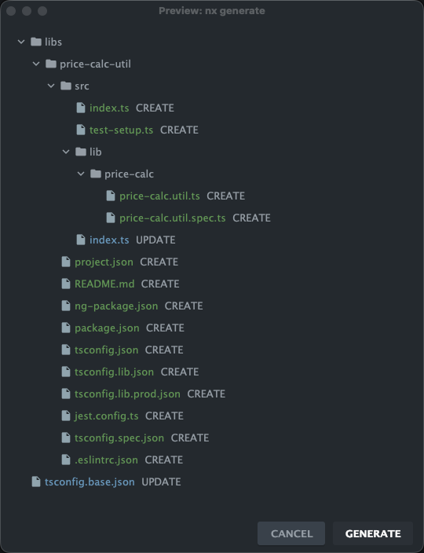 | 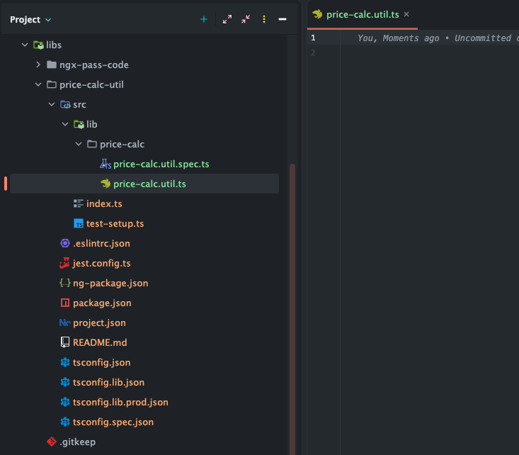 |

</details>

---

### Live Templates

Type the abbreviation in any `.ts` file and press Tab:

| Abbreviation | Expansion |
|-|-|
| `rxm` | `rxMethod<T>(pipe(switchMap(...)))` — NgRx SignalStore rxMethod |
| `inj` | `private readonly name = inject(Service)` — auto-derives name from service |

## Workspace Auto-Detection

The plugin automatically detects your workspace configuration:

| Tool | Detection method | Effect |
|-|-|-|
| ESLint | `.eslintrc.*` or `eslint.config.*` at workspace root | `--linter=none` if absent |
| Jest | `jest.config.*` or `jest.preset.*` at workspace root | `--unitTestRunner=jest` |
| Vitest | `vitest.config.*` or `vitest.workspace.*` at workspace root | `--unitTestRunner=vitest` |
| Stylelint | `.stylelintrc.*` at workspace root | Detected for reference |
| Prettier | `.prettierrc*` at workspace root | Detected for reference |

## Settings

**Settings > Tools > Angular/Nx Scaffolder**

| Setting | Default | Description |
|-|-|-|
| Selector prefix | `app` | Component selector prefix |
| Nx generator | `@nx/angular:library` | Generator command (override for custom workspace generators) |

## Development

### Build

```bash
./gradlew build
```

### Run in sandbox IDE

```bash
./gradlew runIde
```

### Run tests

```bash
./gradlew test
```

### Build distributable

```bash
./gradlew buildPlugin
```

Produces `build/distributions/ng-nx-scaffolder-{version}.zip`.

## Installation

### From disk

1. `./gradlew buildPlugin`
2. **Settings > Plugins > Gear icon > Install Plugin from Disk**
3. Select `build/distributions/ng-nx-scaffolder-{version}.zip`
4. Restart the IDE

### From JetBrains Marketplace

```bash
./gradlew publishPlugin
```

Requires `ORG_GRADLE_PROJECT_intellijPublishToken` environment variable.

## License

MIT
